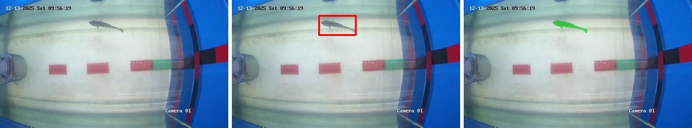
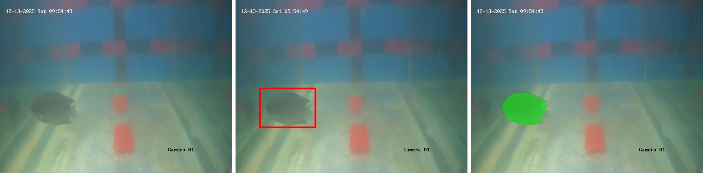

# Fish Weight Estimation using Hybrid YOLO-UNet Segmentation

This repository contains the complete production pipeline for estimating the physical weight of aquatic specimens (specifically fish) in unconstrained, real-world underwater environments. 

The pipeline achieves a state-of-the-art **Mean Absolute Error (MAE) of 3.54g** by completely bypassing the fragility of traditional stereo-vision depth matching in turbid water. It utilizes an **Orthogonal Dual-View (Top/Front) camera setup** paired with a novel **YOLOv12m detection + UNet (mit_b0) segmentation architecture** to extract the true biological dimensions of the fish.

#### Top Camera


#### Front Camera 


## Key Features

*   **Orthogonal Dual-View Calibration:** Bypasses error-prone stereoscopic depth mapping. Uses a deterministic Tape Calibration matrix anchored to the focal plane, mathematically converting pixel footprints into exact real-world centimeters (Length, Width, Height) regardless of optical scaling.
*   **Mix Vision Transformer (mit_b0) Segmentation:** A standard CNN (ResNet) typically fragments segmentation masks due to underwater glare and occlusions. Our pipeline utilizes an advanced UNet initialized with an `mit_b0` encoder, leveraging self-attention to maintain global anatomical continuity of the fish body.
*   **Pseudo-3D Volumetric Ellipsoid Modeling:** Unlike 2D bounding-box regression baselines, this pipeline extracts 12 geometric shape descriptors, utilizing Length and Height to construct a mathematical volumetric ellipsoid, allowing the model to accurately differentiate between long-thin fish and short-fat fish.
*   **Track-Level Median Smoothing (LOFO Evaluated):** Evaluated strictly on Leave-One-Fish-Out (LOFO) cross-validation to prevent data leakage. It is used to address biological deformation by aggregating physical predictions across the temporal track and applying a median filter, eliminating transient anatomical distortions.

## Repository Structure

The repository is organized into a clean, 3-stage pipeline:

```text
Fish-Weight-Pipeline-Pro/
├── data/                       # Ground Truth Data & Extracted Features
├── models/weights/             # YOLO & UNet Weights
├── src/                        
│   ├── 1_computer_vision/      # Camera Sync -> YOLO BBox -> UNet Seg -> Calibration
│   ├── 2_regression_modeling/  # Gradient Boosting Mass Regression & LOFO Eval
│   └── 3_production_inference/ # End-to-End Inference Script on New Videos
└── docs/                       # Results
```

## 🛠️ Usage

### 1. Computer Vision Feature Extraction
To run the automated extraction of geometric features from raw synchronized frames:
```bash
python src/1_computer_vision/extraction_pipeline.py
```

### 2. Regression Training & Evaluation
To train the Gradient Boosting Regressor and validate using Leave-One-Fish-Out (LOFO):
```bash
python src/2_regression_modeling/evaluate_lofo_pipeline.py
```

### 3. Production Inference
To estimate the weight of a fish using a Top and Front frame from a production environment:
```bash
python src/3_production_inference/predict_real_world.py --top path/to/top.jpg --front path/to/front.jpg
```

*(Metrics validated strictly via cross-track LOFO validation to eliminate data leakage.)*
### Visual Pipeline
The extraction process operates in a chronological sequence:
1. **Raw Acquisition**: High-resolution synchronized captures of the fish.
2. **YOLOv12m Localization**: Deterministic bounding box inference dynamically crops the fish from the background.
3. **mit_b0 Segmentation**: Vision Transformer pixel-perfect contouring with morphological opening accurately isolates and segments the fish for volumetric regression.


